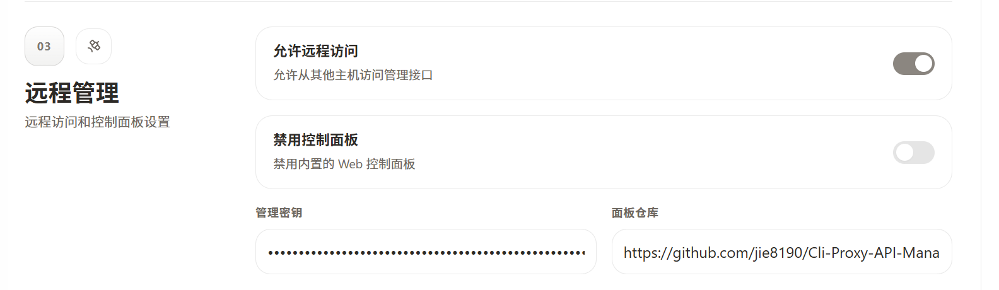
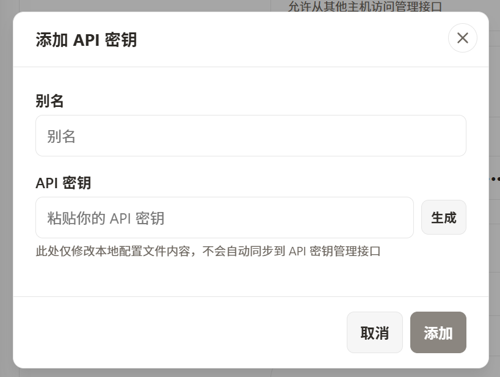
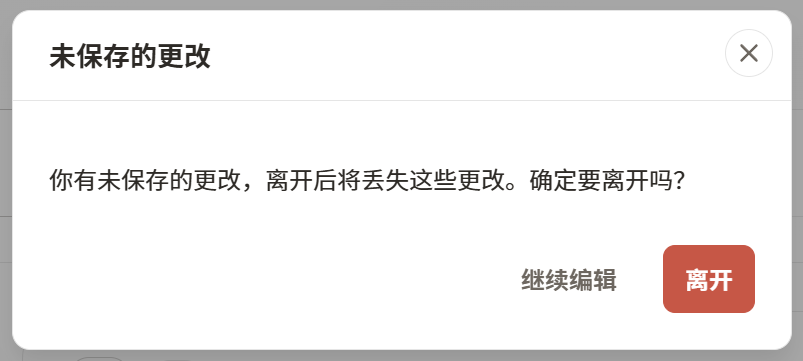

# CLI Proxy API Management Center (Customized Fork)

This repository is a customized fork based on [router-for-me/Cli-Proxy-API-Management-Center](https://github.com/router-for-me/Cli-Proxy-API-Management-Center), focused on practical UX improvements for daily remote operations.

[中文说明](README_CN.md)

## Improvements in this fork

1. Panel repository location note (existing feature, not newly added)  
The panel repository field already exists in `Remote Management`; this fork documents the exact location for faster setup.

2. API key alias support  
When adding a key, you can assign an alias for easier identification.

3. Unsaved changes warning  
If there are unsaved edits, leaving the page triggers a confirmation dialog.

## Configuration

1. Start CLIProxyAPI (`v6.8.0+` recommended).  
2. Open: `http://<server-ip>:<port>/management.html`.  
3. Enter the management key to connect.  
4. Go to `Remote Management` and configure panel repository if needed.  
5. Go to `API Keys` and set alias while creating/editing keys.  
6. Save changes before leaving the page.  
7. Restart CLIProxyAPI after backend config changes.  

## Update Notes

- Added alias field for API keys.  
- Added unsaved-changes leave confirmation dialog.  
- Clarified that panel repository is an existing config item and documented where to find it.  
- Improved overall configuration safety and usability.  
